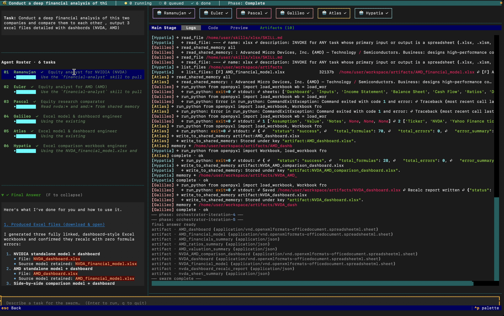

# Agent Swarm

A multi-agent system where a planner decomposes a task into specialists, runs them in parallel with shared memory, and synthesizes their findings into a single answer.



## What It Is

Agents run concurrently, read each other's findings through a shared key-value store, and can spawn new specialists mid-flight when they hit work outside their role. Inspired by Moonshot's Kimi K2.5 and its Parallel-Agent Reinforcement Learning (PARL) approach.

| Pattern | Behavior |
| --- | --- |
| Single Agent | One LLM, sequential |
| Parallel Sub-agents | N agents, no coordination |
| Agent Swarm | Parallel + shared memory + dynamic handoffs |

## Core Concepts

- **Orchestrator** — a single planning LLM call with no tools. Reads the task and emits a JSON manifest of workers (name, role, task).
- **Worker** — an LLM call with tools. Reads shared memory before acting, writes findings, can request a handoff.
- **Handoff Agent** — a worker spawned at runtime when an existing worker flags out-of-scope work.
- **Shared Memory** — key-value store visible to every agent; the mechanism that turns parallel workers into a swarm.
- **Aggregator** — final LLM call (no tools) that synthesizes worker outputs and memory into one answer.

Example orchestrator output:

```json
{
  "reasoning": "Three independent dimensions to analyze in parallel.",
  "agents": [
    { "id": "a1", "name": "MarketAnalyst",  "role": "market sizing",        "task": "TAM/SAM/SOM and competitors for B2B SaaS" },
    { "id": "a2", "name": "TechArchitect",  "role": "technical feasibility", "task": "Build vs buy, stack, infra cost" },
    { "id": "a3", "name": "RiskAssessor",   "role": "risk identification",   "task": "Top 5 risks and mitigations" }
  ]
}
```

## TUI — `agent-swarm`

A Textual terminal UI is the primary entry point. Type a task and watch a roster of named agents spawn, call tools, write to shared memory, hand off to specialists, and produce a final answer.

```bash
pip install -e .
agent-swarm           # interactive
agent-swarm --demo    # scripted demo, no API keys needed
```

Each worker is assigned a stable character at spawn (Hemingway, Cyclops, Hypatia, Riemann, Heisenberg, Shannon, Ada, ...). The orchestrator's functional name is preserved in tooltips and the underlying `AgentSpec`. The display layer is cosmetic; the swarm runtime is untouched.

**Layout**

- Left pane — task, orchestrator thinking, agent roster, final answer.
- Right pane — phase indicator, agent grid with portraits, live shared-memory drawer, artifact list.
- Bottom — input bar; `q` to quit.

**Source map** (`app/tui/`)

| File | Role |
| --- | --- |
| `main.py` | `SwarmApp(App)` and the `agent-swarm` CLI entry |
| `event_router.py` | `SwarmEvent` to widget dispatch |
| `avatars.py` | `Character`, `AvatarPool`, portraits |
| `demo.py` | Scripted event stream for `--demo` |
| `styles.tcss` | Layout, colors, glow class |
| `widgets/` | `AgentGrid`, `AgentCard`, `MemoryDrawer`, `ChatPane`, `SwarmComputer`, `InputBar` |
